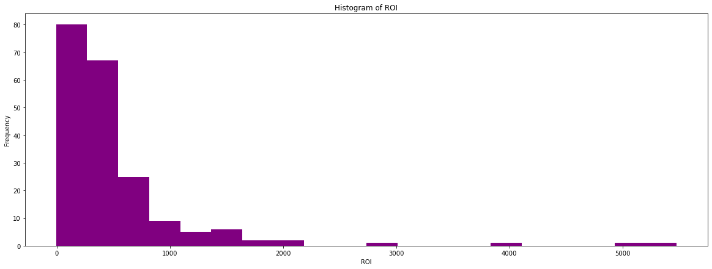

# MICROSOFT PROJECT

## Overview

- Microsoft who do not have any knowledge in movie prodution, have queried a business problem to find out what makes a movie to perform well at the box office. Afer analysis of the data provided, I used various features to determine the solution to the business problem.
- I used various metrics in order to get a better understanding of the analysis and also to be able to amptly answer the question and deliver recommendations to help Microsoft have strategies to use and know how to start a movie studio.
- The metrics used were Gross Profit Margin and Return of Investment which were recommended to be the best metrics to use in analysis of the best performing movies.
- After plotting several graphs comparing the Gross Profit Margin, Return of Investments, Top 200 movies, Year to the worldwide gross and domestic gross, I identified that:
   - The best time to release a movie is late into the year as compared to early in the year.
   - Microsoft could consult the subsidiary company to Walt disney, Buena Vista to get the best strategies on starting up a     successful movie studio.
   - The Return of Investment is a better metric to use as compared to the Gross Profit Margin.
   
## Business Problem 

- Microsoft has seen other companies creating original video content and they want to take a slice of the pie in the movie industry, by creating a new movie studio. However, they have no knowledge about creating movies. Thus, in order to solve this problem we have to answer the question:
        * What films are performing the best at the box office?
- From the article written by Vriety Magazine, https://variety.com/2023/data/news/global-box-office-in-2022-1235480594/, they used the domestic and worldwide gross to determine the answer to the question.
- From this you can tell they could have used ROI as the metric measure to determine the effect of year release of movies on the perfomance of movies.
- Return of Investment is a measure used to evaluate the efficiency and profitability of an investment, relative to its cost.
- In order to further answer the question, I analysed numeric and non-numeric values which were:
        * Year
        * Top 200 movies
        * Release date
        * Gross Profit Margin
        * Return of Investment
        
## Data Understanding

- I examined the datasets The MovieDB, Box Office Mojo and The Numbers to get the data used for analysis.
- Here I read into the datasets to get a better understanding of the appropriate datasets to use for my analysis.

- From the above, this made me come to the conclusion of using The Numbers dataset and the Box Office Mojo dataset since they had the relevant data for my analysis.

## Data Cleaning

- The relevant datasets that I used after loading and reading into them were the Bom Office Mojo and The Numbers.
- In order to analyze the data,we need to clean the datasets by checking for missing values and choosing the appropriate method for dealing with the missing values.

### Missing Values

- We start by checking for missing values if any in the datasets.

- The bom_movies_df dataframe has a couple of missing values. We first deal with the Studio column by navigating into it and finding out the specific values in it so as to determine on the method to use to deal with the missing values.

- We see that the missing values are NaN thus we can drop the values since they do not have a hge significant effect on the dataframe once dropped.
- The method used is .drop() which drops the missing values in the studio column that you have to subset to specify the column in whose missing values you want dropped.

- Display the dataframe to check if they have been dropped.

- Drop also the columns that you feel are not relevant in your analysis. 
- In this case, I dropped the domestic_gross and foreign_gross columns since they weren't relevant columns needed in this dataframe in my analysis.

- Print out the columns of the dataframe to confirm if the columns have been dropped.

### GETTING MOVIES RELEASED WITHIN THE LAST TEN YEARS

- Getting the movies released within the last ten years helps in narrowing down the analysis to a more accurate analysis.

- Converting the datatype of the below columns will aid in the metric calculations used in the analysis bit thus it is crucial to change the datatype.
- You first have to define a function to replace the placeholders in the values to convert them to numerics so as to be able change the datatype from object to integer.

- Confirm whether the datatypes have been changed by displaying the info of the dataframe.

- Merge the two dataframes that are in use to ease the analysis of the data by bringing together the relevant data that is needed in the analysis.

- Check the info of the dataframe to confirm whether the merging was successful or not.

## Methods

- The segment focuses on exploring the relationships in the previously prepared data to get recommendations for the business problem.
- The features used for analysis are:
            * Gross Profit Margin
            * Return of Investment
            * Years
            * Top 200 movies
            * Histograms of Gross Profit Margin and Return of Investment

## Results

### How The Year Of The Movie Affects Performance Of Movie

##### Interpretation Of Average Worlwide Gross By Year Bar Graph

- Movies released after 2013 have a higher average worldwide gross.
- Past movies released before did not perform as well.
- This shows that the movie studio in this day and age would do well since the perfomance of the movies peaked and the worldwide gross income remained high.

### Studio Effect On Performance Of Movies

##### Interpretation of results above

- The best performing studio is Buena Vista, BV.
- This is a subsidiary of the Walt Disney Company.
- This analysis could assist in mapping out the most effective strategies to follow by searching out BV's strategy in order to be the most succesful muvie studio.
- As mentioned before, Microsoft could consult on the best strategies to follow to run a successful studio.

### Top 200 Movies

##### Interpretation of results above

- Movies released late into the year have higher domestic and worldwide gross.
- This indicates that movies peak later on into the year as compared to the beginning of the year.
- This analysis would help in showing when would be the approrpiate time to release a movie in order to have it having a high performance rate.

### Gross Profit Margin effect on Performance of Movie

- This is a metric that measures the profitability of a company's sales after accounting for the direct costs of producing or acquiring the goods sold.
- It is calculated as the difference between a company's revenue (or sales) and the cost of goods sold (COGS), divided by revenue, expressed as a percentage.
- It indicates how much of each dollar of sales is left after deducting the direct costs of producing the goods or services sold. It is an important indicator of a company's operating efficiency and profitability, as it shows the percentage of revenue that is available to cover operating expenses and generate profits.

##### Interpretation Of Gross Profit Margin Scatter Plot Graph

- The gross profit margin scatter plot shows the relationship between the worldwide gross of a movie and its gross profit margin.
- There are more movies whose gross profit margin is high and high worldwide gross.
- The higher the gross profit margin, the more profitable the movie was since the worldwide gross is high.

### Return Of Investment, ROI

- Return of investment is a financial metric that measures the profitability of an investment, typically expressed as a percentage.
- It is a useful tool for making investment decisions, as it helps investors compare the potential profitability of different investment opportunities.

##### Interpretation Of ROI Scatter Plot Graph

- The return of investment scatter plot shows the relationship between the worldwide gross of a movie and its ROI.
- A higher ROI indicates a more profitable investment, while a negative ROI means that the investment has resulted in a loss.
- There are more movies whose ROI  is relatively high and has a high worldwide gross.
- Regardless of it not being very high, it's still relatively high and shows that the perfomance of the movie will be high due to the worldwide gross being high thus having a high ROI.

### Histogram for Gross Profit Margin

##### Iinterpretation Of Gross Profit Margin Histogram

- From the histogram, we see that the majority of movies have a GPM  between 50 and 100 peaking around 75. 
- This means that for the majority of movies, the production budget is close to or higher than the gross profit.
- It shows that there is a wide range of GPM values for movies, with a majority of movies falling within the range of 55-98.

### Histogram for ROI

##### Interpretation Of ROI Histogram

- From the histogram, we can see that the majority of movies have an ROI between 0 and 200%, with a peak around 25-50%
- There are also a few movies with an extremely high ROI, above 1000%, which are outliers in the data.
- This indicates that while many movies are profitable, there is also a significant number of movies that do not perform well in terms of ROI. It shows the risk and unpredictability involved in the film industry.

## Recommendations

- I would recommend using the gross profit margin and return of investment since they give a more accurate reading, but more inclination towards the ROI metric.
- This is because movies with a high ROI yield a higher worldwide gross.
- They should also consider consulting the subsidiary of the Walt Disney Company, Buena Vista in order to get insights on how to better the performance of the movie.

# Technologies Used

- Python
- Pandas
- NumPy
- Matplotlib

# Repository Structure

- Datasets                             <- Data used in the analysis of project 
    - bom.movie_gross.csv
    - tn.movie_budgets.csv
- Saved Pictures                       <- Images got from the code file
- .gitignore                           <- The .gitignore file for the project
- LICENSE.md                           <- The license for the project
- Presentation_pdf.pdf                     <- Presentation of analysis in PDF format
- README.md1                           <- Document for reviewing the project
- student.ipynb                              <- Documentation of analysis of project in Jupyter Notebook

# For More Information;

- To review [Click here to open my Jupyter Notebook](./student.ipynb)
- To view my presentation, click [here](.\Presentation_pdf.pdf)
